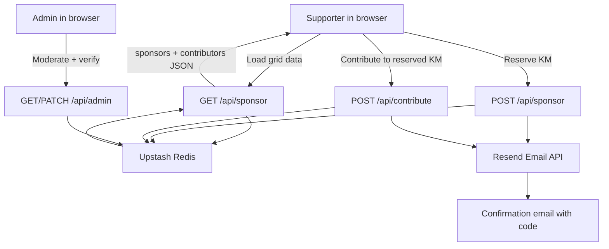

<div align="center">

# Berlin Marathon Fundraising

[](https://vercel.com)
[](https://upstash.com)
[](https://resend.com)
[](https://developer.mozilla.org/en-US/docs/Web/JavaScript)

A simple but powerful 42km sponsorship app: people reserve a KM, get a code by email, donate, and admins verify everything.

</div>

## Quick Summary
- Pick a kilometre (1-42), reserve it, and get a verification code by email.
- Data is stored in Upstash Redis with anti-collision locks so two people cannot claim the same KM at the same time.
- Admin dashboard verifies donations, confirms contributors, and can safely unreserve/archive KMs.

## Architecture



## How it works
1. The frontend loads current sponsor/contributor data through `GET /api/sponsor` (which reads from Redis).
2. API checks input, rate limits, and puts a short lock on that KM in Redis.
3. If KM is free, it saves sponsor/contributor data and generates a code.
4. API sends a confirmation email through Resend.
5. Admin later confirms amounts/status from `admin.html`.

## Upstash Redis (core of the app)

### Why Redis here
- Very fast reads/writes for live grid updates.
- Simple key-based model for `KM -> sponsor` mapping.
- Great fit for serverless APIs.

### Main keys used
- `marathon:sponsors` (hash): `km -> sponsorRecord`
- `marathon:codes` (hash): `verificationCode -> km`
- `marathon:contributors` (hash): `contributionCode -> contributorRecord`
- `marathon:contributors:by-km:{km}` (set): contributor index per KM
- `marathon:contributors:counter:{km}` (string): increments contribution code suffix
- `marathon:km-lock:{km}` (string): short lock to avoid race conditions
- `marathon:rate:*` (strings): per-IP rate limit counters

### Guardrails implemented
- KM must be 1-42.
- Sponsor amount minimum is £85.
- Contributor amount range is 1-10000.
- Email validation on sponsor and contributor forms.
- Rate limiting on sponsor, contribute, and admin endpoints.

## Email integration (Resend)

### What is already integrated
- `POST /api/sponsor` sends a reservation email with `verificationCode`.
- `POST /api/contribute` sends a contribution email with `contributionCode`.
- Both include donation link + instructions to include code in donation message.

### Important setup note
The sender is hardcoded as:
- `sponsor@42kmforsudan.com`

Your Resend account/domain must be configured to allow this sender.

## Run locally

### 1. Prerequisites
- Node.js 18+
- npm
- Vercel CLI

```bash
npm i -g vercel
```

### 2. Install
```bash
git clone https://github.com/Himikid/berlin-marathon-fundraising.git
cd berlin-marathon-fundraising
npm install
```

### 3. Create `.env.local`
```bash
# Upstash (required)
KV_REST_API_URL="https://..."
KV_REST_API_TOKEN="..."

# Admin API auth (required)
ADMIN_TOKEN="choose-a-long-random-secret"

# Resend email (required for sending confirmation emails)
RESEND_API_KEY="re_..."
```

### 4. Start app
```bash
vercel dev
```

Open:
- `http://localhost:3000/` (public app)
- `http://localhost:3000/admin.html` (admin app)

## Quick test flow
1. Reserve a KM from public app.
2. Confirm response includes `verificationCode` and `emailSent`.
3. Add a contributor on same KM.
4. Confirm response includes `contributionCode` and `emailSent`.
5. Open admin page, set token, verify sponsor/contributor.

## API map
- `GET /api/sponsor`: load public sponsor + contributor state.
- `POST /api/sponsor`: reserve KM + send sponsor email.
- `POST /api/contribute`: add contributor + send contribution email.
- `GET /api/admin`: admin snapshot (requires token).
- `PATCH /api/admin`: verify sponsor, change contributor status, remove contributor, unreserve KM.

## Security notes
- Keep `.env.local` private.
- Never expose `KV_REST_API_TOKEN`, `RESEND_API_KEY`, or `ADMIN_TOKEN` in frontend code.
- Keep admin token server-side only and rotate it if leaked.

## Project files

```text
.
├── api/
│   ├── sponsor.js
│   ├── contribute.js
│   └── admin.js
├── public/
│   ├── index.html
│   ├── script.js
│   ├── admin.html
│   ├── admin.js
│   └── style.css
└── lib/
    └── redis.js
```
