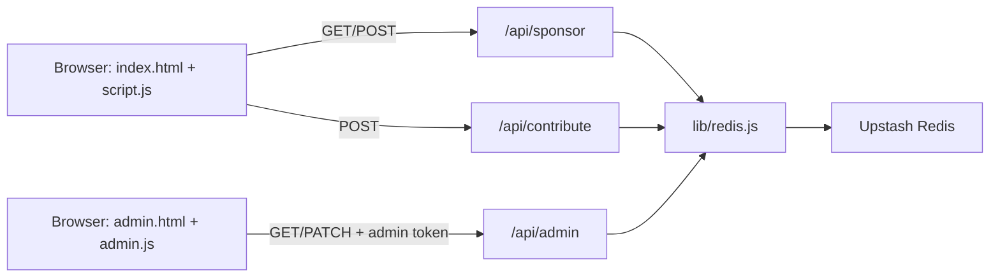

<div align="center">

# Berlin Marathon Fundraising

[](https://vercel.com)
[](https://upstash.com)
[](https://developer.mozilla.org/en-US/docs/Web/JavaScript)
[](#api-reference)

A fast, interactive fundraising app where supporters reserve one of 42 marathon kilometers, contribute toward existing KMs, and admins verify/archive records.

</div>

## Why this project stands out
- Live 42-KM sponsorship grid with clear status states (`available`, `pending`, `confirmed`).
- Primary sponsor plus contributor flow per KM.
- Built-in anti-race-condition locking for KM writes in Redis.
- Admin portal for verification, contributor moderation, and archival resets.
- Serverless API design ready for Vercel + Upstash.

## Architecture



### Runtime model
- Frontend: static HTML/CSS/JS.
- Backend: Vercel Serverless Functions in `/api`.
- Data store: Upstash Redis via `@upstash/redis` (`Redis.fromEnv()`).
- Auth model: public endpoints are open but rate-limited; admin endpoint requires `ADMIN_TOKEN`.

## Repository layout

```text
.
├── index.html            # Main fundraising experience
├── script.js             # Main client logic
├── admin.html            # Admin dashboard UI
├── admin.js              # Admin dashboard logic
├── api/
│   ├── sponsor.js        # Reserve/read sponsors
│   ├── contribute.js     # Add contributors to reserved KM
│   └── admin.js          # Verify/unreserve/remove contributor
└── lib/
    └── redis.js          # Upstash Redis client
```

## Data model (Upstash Redis)

### Active keys
- `marathon:sponsors` (hash): `km -> sponsorRecord`
- `marathon:codes` (hash): `verificationCode -> km`
- `marathon:contributors` (hash): `contributionCode -> contributorRecord`
- `marathon:contributors:by-km:{km}` (set): indexed contributor codes per KM
- `marathon:contributors:counter:{km}` (string): counter used to generate contribution codes
- `marathon:km-lock:{km}` (string): short-lived lock to prevent conflicting writes
- `marathon:rate:*` (strings): per-IP request counters for throttling

### Archive/history keys
- `marathon:codes:history`
- `marathon:sponsors:history`
- `marathon:contributors:history`

## API reference

### `GET /api/sponsor`
Returns public state for rendering the grid.

### `POST /api/sponsor`
Reserves a KM and generates a `verificationCode`.

Request body (shape):
```json
{
  "km": 12,
  "sponsor_type": "individual | group | sadaqah_jariyah",
  "name": "...",
  "group_name": "...",
  "for_name": "...",
  "from_name": "...",
  "email": "...",
  "message": "..."
}
```

### `POST /api/contribute`
Adds a contributor to an already reserved KM and generates `contributionCode`.

Request body (shape):
```json
{
  "km": 12,
  "name": "...",
  "email": "...",
  "message": "...",
  "amount": 25
}
```

### `GET /api/admin`
Returns admin snapshot (sponsors + contributorsByKm). Requires token header.

Headers:
- `x-admin-token: <ADMIN_TOKEN>`
- or `Authorization: Bearer <ADMIN_TOKEN>`

### `PATCH /api/admin`
Admin actions:
- `verify_sponsor` with `km`, `verified_amount`
- `set_contributor_status` with `contribution_code`, `status`, optional `amount`
- `remove_contributor` with `contribution_code`, optional `reason`
- `unreserve_km` with `km`, optional `reason`

## Input validation + guardrails
- KM bounds: `1..42`.
- Email format checks on sponsor/contributor input.
- Amount constraints:
  - Contributor amount: `1..10000`
  - Admin verified amount: `0..10000`
- Rate limits (per IP, 10-minute window):
  - Sponsor endpoint: 12 requests
  - Contribute endpoint: 20 requests
  - Admin endpoint: 120 requests
- Distributed lock on `marathon:km-lock:{km}` to avoid write collisions.

## Replicate this project

### 1. Prerequisites
- Node.js 18+
- npm
- Vercel CLI (`npm i -g vercel`)
- Upstash Redis database

### 2. Clone and install
```bash
git clone https://github.com/Himikid/berlin-marathon-fundraising.git
cd berlin-marathon-fundraising
npm install
```

### 3. Configure environment
Create `.env.local` with:

```bash
# Required for Upstash client (Redis.fromEnv)
KV_REST_API_URL="..."
KV_REST_API_TOKEN="..."

# Required for admin endpoint auth
ADMIN_TOKEN="set-a-long-random-secret"
```

Notes:
- Your local file currently includes extra platform variables (for example `KV_URL`, `REDIS_URL`, `KV_REST_API_READ_ONLY_TOKEN`, `VERCEL_OIDC_TOKEN`), but the code path here only needs the three variables above.
- Never expose `ADMIN_TOKEN` or Upstash tokens in frontend code.

### 4. Run locally
```bash
vercel dev
```
Open:
- `http://localhost:3000/` (public app)
- `http://localhost:3000/admin.html` (admin portal)

### 5. Deploy
```bash
vercel --prod
```
Set the same env vars in Vercel Project Settings before production deploy.

## Quick cURL tests

Reserve a KM:
```bash
curl -X POST http://localhost:3000/api/sponsor \
  -H 'Content-Type: application/json' \
  -d '{"km":7,"sponsor_type":"individual","name":"Amina","email":"amina@example.com","message":"For everyone cheering!"}'
```

Contribute to reserved KM:
```bash
curl -X POST http://localhost:3000/api/contribute \
  -H 'Content-Type: application/json' \
  -d '{"km":7,"name":"Yusuf","email":"yusuf@example.com","message":"Let\"s go","amount":30}'
```

Admin snapshot:
```bash
curl http://localhost:3000/api/admin \
  -H 'x-admin-token: YOUR_ADMIN_TOKEN'
```

Verify sponsor:
```bash
curl -X PATCH http://localhost:3000/api/admin \
  -H 'Content-Type: application/json' \
  -H 'x-admin-token: YOUR_ADMIN_TOKEN' \
  -d '{"action":"verify_sponsor","km":7,"verified_amount":85}'
```

## Security cross-check (current workspace)
I checked the repository for accidental secret exposure in tracked code and git state:
- `.env.local` is present locally but ignored by git via `.gitignore` rule `.env*.local`.
- `.env.local` is not currently tracked by git.
- No hardcoded API keys, private keys, or token literals were found in scanned project files.
- Admin auth uses runtime env var `process.env.ADMIN_TOKEN` (server-side), and frontend only sends user-entered token at request time.

Recommended hardening before sharing publicly:
- Rotate any token that may ever have been pasted into logs/screenshots.
- Add `.env.example` with placeholder values (never real values).
- Keep `admin.html` behind additional protection if possible (Vercel password, middleware, or IP allowlist).

## Tech stack
- HTML/CSS/Vanilla JS frontend
- Vercel Serverless Functions
- Upstash Redis (`@upstash/redis`)

---
